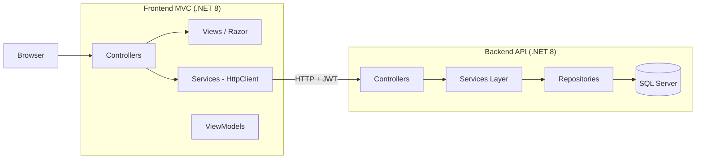
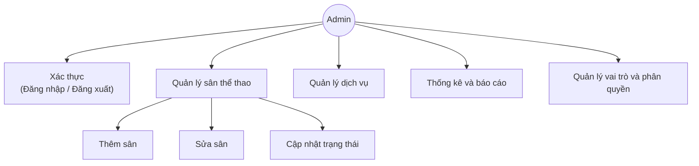
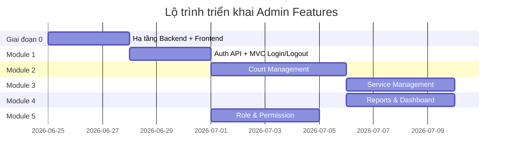

# Kế hoạch triển khai chức năng Admin — Sport Court Management

> **Mục đích:** Tài liệu này mô tả kế hoạch chi tiết để triển khai các chức năng Admin theo sơ đồ use case, với **Frontend MVC** (`Frontend/SportCourtManagement_FrontEnd`) gọi **Backend API** (`Project-Final/SportCourtManagent_Server`).
>
> **Trạng thái hiện tại:** Cần xác nhận trước khi bắt đầu code.

---

## 1. Tổng quan kiến trúc



| Thành phần | Đường dẫn | Trạng thái hiện tại |
|------------|-----------|---------------------|
| **Frontend MVC** | `Frontend/SportCourtManagement_FrontEnd` | Template mặc định — chưa có chức năng nghiệp vụ |
| **Backend API (mới)** | `Project-Final/SportCourtManagent_Server` | Đã có Models, DbContext, Migration, Repository stubs — **chưa có Controllers/Services/DTOs** |
| **Backend API (tham chiếu)** | `Project-Final/backend/SportCourtManagerment` | Đã có Auth + Court Management hoạt động — dùng làm **nguồn tham khảo** khi port sang server mới |
| **React UI (tham chiếu)** | `Project-Final/frontend/src/pages/admin/` | UI court management đã làm khá đầy đủ — tham khảo layout/flow khi viết Razor Views |
| **Tài liệu thiết kế** | `Project-Final/API_Design.md`, `SRS.md` | Đặc tả API và ma trận phân quyền |

### Quyết định kiến trúc cần xác nhận

| # | Câu hỏi | Đề xuất |
|---|---------|---------|
| 1 | Backend chính dùng folder nào? | `SportCourtManagent_Server` — port logic từ `backend/SportCourtManagerment` sang kiến trúc layered mới |
| 2 | Frontend lưu JWT ở đâu? | Cookie HttpOnly (MVC server-side) hoặc Session — tránh lộ token qua JavaScript |
| 3 | Phân quyền enforce ở đâu? | **Cả Backend API** (`[Authorize(Roles = "Admin")]`) **và Frontend MVC** (`[Authorize]` + ẩn menu) |
| 4 | CORS | MVC gọi API server-side qua `HttpClient` → **không cần CORS** nếu dùng BFF pattern; nếu gọi từ browser thì cần thêm port `5166`/`7121` |

---

## 2. Sơ đồ chức năng Admin (theo ảnh use case)



---

## 3. Hiện trạng từng module

| Module | Backend (`SportCourtManagent_Server`) | Backend tham chiếu (`SportCourtManagerment`) | Frontend MVC |
|--------|---------------------------------------|---------------------------------------------|--------------|
| **Đăng nhập / Đăng xuất** | ❌ Chưa có | ✅ JWT, OTP verify, refresh token | ❌ Chưa có |
| **Quản lý sân (Thêm/Sửa/Status)** | ❌ Chưa có (entity `Court` đã có) | ✅ CRUD complexes + courts, upload ảnh | ❌ Chưa có |
| **Quản lý dịch vụ** | ❌ Chưa có (entity `Service` đã có) | ⚠️ Seed data only, chưa có API | ❌ Chưa có |
| **Thống kê & báo cáo** | ❌ Chưa có | ⚠️ Chỉ có `/api/complexes/stats` cơ bản | ❌ Chưa có |
| **Vai trò & phân quyền** | ❌ Chưa có (entity `Role`, `UserRole` đã có) | ⚠️ Role trong JWT, chưa có API quản lý role | ❌ Chưa có |

---

## 4. Giai đoạn 0 — Hạ tầng chung (Bắt buộc trước mọi module)

> **Mục tiêu:** Thiết lập nền tảng để các module sau có thể gọi API và bảo vệ route Admin.

### 4.1 Backend — Hoàn thiện kiến trúc cơ bản

| STT | Task | Chi tiết | Tham chiếu |
|-----|------|----------|------------|
| 0.1 | Implement Repositories | Viết logic thay `NotImplementedException` cho các repo cần dùng trước: `User`, `Role`, `UserRole`, `Court`, `CourtComplex`, `CourtType`, `Service` | `SportCourtManagent_Server/DataAccess/` |
| 0.2 | Tạo DTOs | `ApiResponse<T>`, `PagedResult<T>`, DTOs cho Auth, Court, Service, Report, Role | `backend/SportCourtManagerment/DTOs/` |
| 0.3 | Tạo Services Layer | `IAuthService`, `ICourtService`, `IServiceService`, `IReportService`, `IRoleService` | `document/SYSTEM_STRUCTURE.md` |
| 0.4 | Cấu hình JWT Auth | `AddAuthentication(JwtBearer)`, `UseAuthentication()`, BCrypt hash password | `backend/SportCourtManagerment/Program.cs`, `Services/TokenService.cs` |
| 0.5 | Global Exception Handler | Middleware trả `ApiResponse` chuẩn khi lỗi | `API_Design.md` §3 |
| 0.6 | Seed data | Roles (Admin, Staff, Coach, Customer), admin account, court types, sample courts/services | `backend/SportCourtManagerment/Data/DbSeeder.cs` |

### 4.2 Frontend MVC — Hạ tầng API client

| STT | Task | Chi tiết | File tạo mới |
|-----|------|----------|--------------|
| 0.7 | Cấu hình API Base URL | `appsettings.json` → `"ApiSettings": { "BaseUrl": "http://localhost:5211" }` | `appsettings.json` |
| 0.8 | Đăng ký HttpClient | `AddHttpClient<IApiClient, ApiClient>()` với handler gắn JWT từ cookie/session | `Program.cs` |
| 0.9 | ApiClient base class | Wrapper gọi API, deserialize `ApiResponse<T>`, xử lý 401 | `Services/ApiClient.cs` |
| 0.10 | Layout Admin | Sidebar, navbar, breadcrumb, flash messages (TempData) | `Views/Shared/_AdminLayout.cshtml` |
| 0.11 | Cookie Authentication MVC | `AddAuthentication(Cookie)` + lưu JWT sau login | `Program.cs` |
| 0.12 | Area Admin | Tách route `/Admin/...` cho các chức năng quản trị | `Areas/Admin/` |

**Deliverable Giai đoạn 0:** Backend chạy Swagger với ít nhất health check + auth endpoint; Frontend có layout admin và gọi được API.

---

## 5. Module 1 — Xác thực (Đăng nhập / Đăng xuất)

> **Actor:** Admin (và các role khác dùng chung flow)
> **Phụ thuộc:** Giai đoạn 0

### 5.1 Backend API

| Endpoint | Method | Mô tả | Trạng thái tham chiếu |
|----------|--------|-------|----------------------|
| `/api/auth/login` | POST | Đăng nhập, trả JWT + refresh token | ✅ Đã có — cần port |
| `/api/auth/logout` | POST | Xóa refresh token | ✅ Đã có — cần port |
| `/api/auth/register` | POST | Đăng ký (Customer) | ✅ Đã có — cần port |
| `/api/auth/verify-email` | POST | Xác thực OTP | ✅ Đã có — cần port |
| `/api/auth/refresh-token` | POST | Làm mới token | ✅ Đã có — cần port |
| `/api/auth/me` | GET | Thông tin user hiện tại + role | ✅ Đã có — cần port |

**Tasks Backend:**

- [ ] Port `AuthController` + `TokenService` + `EmailService`
- [ ] Port DTOs: `LoginRequest`, `LoginResponse`, `RegisterRequest`, `VerifyEmailRequest`
- [ ] Thêm `[Authorize(Roles = "Admin")]` cho các endpoint admin-only (ở module khác)

### 5.2 Frontend MVC

| Màn hình | Route | Controller Action | Mô tả |
|----------|-------|-------------------|-------|
| Đăng nhập | `/Account/Login` | `AccountController.Login` GET/POST | Form email + password, redirect theo role |
| Đăng ký | `/Account/Register` | `AccountController.Register` GET/POST | Form đăng ký customer |
| Xác thực OTP | `/Account/VerifyEmail` | `AccountController.VerifyEmail` GET/POST | Nhập 6 số OTP |
| Đăng xuất | `/Account/Logout` | `AccountController.Logout` POST | Gọi API logout + xóa cookie |

**Files tạo mới:**

```
Controllers/AccountController.cs
Models/ViewModels/Auth/LoginViewModel.cs
Models/ViewModels/Auth/RegisterViewModel.cs
Models/ViewModels/Auth/VerifyEmailViewModel.cs
Services/IAuthApiService.cs
Services/AuthApiService.cs
Views/Account/Login.cshtml
Views/Account/Register.cshtml
Views/Account/VerifyEmail.cshtml
```

**Tham chiếu UI/Logic:** `Project-Final/frontend/src/pages/auth/LoginPage.tsx`, `RegisterPage.tsx`, `VerifyEmailPage.tsx`

**Tài khoản test (seed):**

| Role | Email | Password |
|------|-------|----------|
| Admin | `admin@sportscourtms.vn` | `Admin@123` |

**Acceptance Criteria:**

- [ ] Admin đăng nhập thành công → redirect `/Admin/Dashboard`
- [ ] Token hết hạn → tự refresh hoặc redirect login
- [ ] Đăng xuất → không truy cập được route Admin

---

## 6. Module 2 — Quản lý sân thể thao

> **Actor:** Admin
> **Chức năng con:** Thêm sân, Sửa sân, Cập nhật trạng thái
> **Phụ thuộc:** Module 1 (Auth)

### 6.1 Phạm vi nghiệp vụ

Hệ thống quản lý theo 2 cấp:

1. **Tổ hợp sân (Court Complex)** — khu vực chứa nhiều sân
2. **Sân (Court)** — từng sân cụ thể trong tổ hợp

**Trạng thái sân (`CourtStatus`):**

| Giá trị | Hiển thị | Mô tả |
|---------|----------|-------|
| `Active` | Hoạt động | Sân sẵn sàng đặt |
| `Maintenance` | Bảo trì | Tạm ngưng đặt |
| `Inactive` | Ngừng hoạt động | Không hiển thị cho khách |

### 6.2 Backend API

| Endpoint | Method | Mô tả | Auth | Trạng thái tham chiếu |
|----------|--------|-------|------|----------------------|
| `/api/complexes` | GET | Danh sách tổ hợp (search, filter, pagination) | Admin | ✅ Port |
| `/api/complexes` | POST | **Thêm** tổ hợp mới | Admin | ✅ Port |
| `/api/complexes/{id}` | GET | Chi tiết tổ hợp | Admin | ✅ Port |
| `/api/complexes/{id}` | PUT | **Sửa** tổ hợp | Admin | ✅ Port |
| `/api/complexes/{id}` | DELETE | Xóa mềm tổ hợp | Admin | ✅ Port |
| `/api/complexes/stats` | GET | Thống kê nhanh (dùng cho dashboard) | Admin | ✅ Port |
| `/api/complexes/upload-image` | POST | Upload ảnh tổ hợp | Admin | ✅ Port |
| `/api/courts` | GET | Danh sách sân (filter theo complex, type, status) | Admin | ✅ Port |
| `/api/courts` | POST | **Thêm** sân mới | Admin | ✅ Port |
| `/api/courts/{id}` | GET | Chi tiết sân | Admin | ✅ Port |
| `/api/courts/{id}` | PUT | **Sửa** thông tin sân | Admin | ✅ Port |
| `/api/courts/{id}` | DELETE | Xóa mềm sân | Admin | ✅ Port |
| `/api/courts/{id}/status` | PATCH | **Cập nhật trạng thái** sân | Admin | ⚠️ Cần tách hoặc dùng PUT |
| `/api/court-types` | GET | Danh sách loại sân | Public/Admin | ✅ Port |
| `/api/users?role=Manager` | GET | Dropdown chọn quản lý tổ hợp | Admin | ✅ Port |

**Tasks Backend:**

- [ ] Port `CourtComplexesController`, `CourtsController`
- [ ] Port DTOs: `CourtDto`, `CreateCourtRequest`, `UpdateCourtRequest`, `CourtComplexDto`, ...
- [ ] Implement `ICourtRepository`, `ICourtComplexRepository`
- [ ] Thêm `[Authorize(Roles = "Admin")]` trên mutation endpoints
- [ ] Endpoint PATCH status (hoặc field `status` trong PUT)

### 6.3 Frontend MVC

#### Màn hình

| # | Màn hình | Route | Chức năng |
|---|----------|-------|-----------|
| 1 | Danh sách tổ hợp | `/Admin/Complexes` | Bảng + search + filter + pagination + stats cards |
| 2 | Thêm tổ hợp | `/Admin/Complexes/Create` | Form tạo mới + upload ảnh |
| 3 | Sửa tổ hợp | `/Admin/Complexes/Edit/{id}` | Form chỉnh sửa |
| 4 | Chi tiết tổ hợp | `/Admin/Complexes/Details/{id}` | Thông tin tổ hợp + danh sách sân bên trong |
| 5 | Thêm sân | `/Admin/Complexes/{complexId}/Courts/Create` | Form tạo sân trong tổ hợp |
| 6 | Sửa sân | `/Admin/Courts/Edit/{id}` | Form chỉnh sửa sân |
| 7 | Cập nhật trạng thái | Inline trên danh sách / modal | Dropdown đổi Active/Maintenance/Inactive |

**Files tạo mới:**

```
Areas/Admin/Controllers/ComplexesController.cs
Areas/Admin/Controllers/CourtsController.cs
Areas/Admin/Models/ComplexViewModel.cs
Areas/Admin/Models/CourtViewModel.cs
Areas/Admin/Models/CourtStatusUpdateViewModel.cs
Services/ICourtApiService.cs
Services/CourtApiService.cs
Views/Admin/Complexes/Index.cshtml
Views/Admin/Complexes/Create.cshtml
Views/Admin/Complexes/Edit.cshtml
Views/Admin/Complexes/Details.cshtml
Views/Admin/Courts/Create.cshtml
Views/Admin/Courts/Edit.cshtml
Views/Admin/Courts/_StatusBadge.cshtml (partial)
```

**Tham chiếu UI:** `ManageCourtsPage.tsx` (~791 dòng), `ComplexDetailPage.tsx` (~890 dòng)

**Acceptance Criteria:**

- [ ] Admin thêm tổ hợp + sân mới thành công
- [ ] Admin sửa thông tin sân (tên, loại, giá, giờ mở cửa)
- [ ] Admin đổi trạng thái sân → hiển thị badge màu tương ứng
- [ ] Xóa mềm — sân không còn hiện trong danh sách active
- [ ] Validation form (required fields, giá > 0, giờ mở < giờ đóng)
- [ ] Upload ảnh tổ hợp/sân hoạt động

---

## 7. Module 3 — Quản lý dịch vụ

> **Actor:** Admin
> **Phụ thuộc:** Module 1 (Auth)

### 7.1 Phạm vi nghiệp vụ

Quản lý các dịch vụ bổ sung kèm theo đặt sân:

| Loại (`Category`) | Ví dụ |
|-------------------|-------|
| `Equipment` | Thuê vợt, bóng, lưới |
| `Drink` | Nước uống, đồ ăn nhẹ |
| `Coach` | Huấn luyện viên theo giờ |
| `Event` | Tổ chức giải đấu, sự kiện |

**Trường dữ liệu chính (`Service` entity):** `ServiceName`, `Category`, `Price`, `StockQty`, `Description`, `IsActive`

### 7.2 Backend API

| Endpoint | Method | Mô tả | Auth |
|----------|--------|-------|------|
| `/api/services` | GET | Danh sách dịch vụ (filter theo category, search, pagination) | Admin |
| `/api/services/{id}` | GET | Chi tiết dịch vụ | Admin |
| `/api/services` | POST | **Thêm** dịch vụ mới | Admin |
| `/api/services/{id}` | PUT | **Sửa** dịch vụ | Admin |
| `/api/services/{id}` | DELETE | Xóa / vô hiệu hóa dịch vụ | Admin |
| `/api/services/{id}/stock` | PATCH | Cập nhật tồn kho | Admin |
| `/api/equipment` | GET | Danh sách kho dụng cụ (nếu tách riêng) | Admin |
| `/api/equipment/{id}` | PUT | Cập nhật tồn kho dụng cụ | Admin |

**Tasks Backend:**

- [ ] Tạo `ServicesController` (chưa có ở cả 2 backend)
- [ ] Tạo DTOs: `ServiceDto`, `CreateServiceRequest`, `UpdateServiceRequest`
- [ ] Implement `IServiceRepository` + `IServiceService`
- [ ] Validation: giá ≥ 0, stock ≥ 0, tên không trùng
- [ ] `[Authorize(Roles = "Admin")]`

**Tham chiếu spec:** `API_Design.md` §2.6

### 7.3 Frontend MVC

| # | Màn hình | Route | Chức năng |
|---|----------|-------|-----------|
| 1 | Danh sách dịch vụ | `/Admin/Services` | Bảng + filter theo category + search |
| 2 | Thêm dịch vụ | `/Admin/Services/Create` | Form tạo mới |
| 3 | Sửa dịch vụ | `/Admin/Services/Edit/{id}` | Form chỉnh sửa |
| 4 | Chi tiết / Tồn kho | `/Admin/Services/Details/{id}` | Xem + cập nhật stock |

**Files tạo mới:**

```
Areas/Admin/Controllers/ServicesController.cs
Areas/Admin/Models/ServiceViewModel.cs
Services/IServiceApiService.cs
Services/ServiceApiService.cs
Views/Admin/Services/Index.cshtml
Views/Admin/Services/Create.cshtml
Views/Admin/Services/Edit.cshtml
Views/Admin/Services/Details.cshtml
```

**Acceptance Criteria:**

- [ ] CRUD dịch vụ đầy đủ
- [ ] Filter theo loại dịch vụ (Equipment/Drink/Coach/Event)
- [ ] Cập nhật tồn kho hiển thị realtime trên danh sách
- [ ] Vô hiệu hóa dịch vụ (soft delete / IsActive = false)

---

## 8. Module 4 — Thống kê và báo cáo

> **Actor:** Admin
> **Phụ thuộc:** Module 1, 2 (cần có dữ liệu sân); ideally có booking data

### 8.1 Phạm vi nghiệp vụ

| Báo cáo | Mô tả | Nguồn dữ liệu |
|---------|-------|---------------|
| Dashboard tổng quan | Cards: tổng doanh thu, booking, tỷ lệ lấp đầy, KH active | `Booking`, `Payment`, `Court` |
| Thống kê sân | Số sân theo trạng thái (active/maintenance/inactive) | `Court` |
| Báo cáo doanh thu | Biểu đồ theo ngày/tuần/tháng | `Payment`, `Invoice` |
| Tần suất sử dụng sân | Heatmap / bar chart theo khung giờ | `Booking`, `TimeSlot` |
| Top sân đánh giá cao | Bảng xếp hạng | `Review`, `Court` |

### 8.2 Backend API

| Endpoint | Method | Mô tả | Auth | Trạng thái |
|----------|--------|-------|------|------------|
| `/api/reports/dashboard` | GET | Tổng hợp dashboard | Admin | ❌ Cần tạo mới |
| `/api/reports/revenue` | GET | Doanh thu theo thời gian | Admin | ❌ Cần tạo mới |
| `/api/reports/court-usage` | GET | Tần suất sử dụng sân | Admin | ❌ Cần tạo mới |
| `/api/complexes/stats` | GET | Stats sân cơ bản | Admin | ✅ Port từ backend cũ |

**Tasks Backend:**

- [ ] Tạo `ReportsController`
- [ ] Tạo `IReportService` với LINQ aggregation queries
- [ ] DTOs: `DashboardSummaryDto`, `RevenueReportDto`, `CourtUsageDto`
- [ ] Query params: `complexId`, `startDate`, `endDate`, `period` (Day/Week/Month)
- [ ] **Lưu ý:** Nếu chưa có module Booking → dashboard chỉ hiển thị stats sân + placeholder cho doanh thu

**Tham chiếu spec:** `API_Design.md` §2.11
**Tham chiếu UI:** `Project-Final/prototype/pages/admin/reports/`

### 8.3 Frontend MVC

| # | Màn hình | Route | Chức năng |
|---|----------|-------|-----------|
| 1 | Dashboard Admin | `/Admin/Dashboard` | Cards thống kê + biểu đồ tổng quan |
| 2 | Báo cáo doanh thu | `/Admin/Reports/Revenue` | Biểu đồ line/bar + filter thời gian |
| 3 | Báo cáo sử dụng sân | `/Admin/Reports/CourtUsage` | Biểu đồ theo khung giờ |

**Files tạo mới:**

```
Areas/Admin/Controllers/DashboardController.cs
Areas/Admin/Controllers/ReportsController.cs
Areas/Admin/Models/DashboardViewModel.cs
Areas/Admin/Models/RevenueReportViewModel.cs
Services/IReportApiService.cs
Services/ReportApiService.cs
Views/Admin/Dashboard/Index.cshtml
Views/Admin/Reports/Revenue.cshtml
Views/Admin/Reports/CourtUsage.cshtml
wwwroot/js/charts.js (Chart.js)
```

**Thư viện gợi ý:** Chart.js (CDN hoặc npm) — tham khảo prototype HTML

**Acceptance Criteria:**

- [ ] Dashboard hiển thị ít nhất 4 stat cards
- [ ] Biểu đồ doanh thu render đúng khi có data
- [ ] Filter theo khoảng thời gian hoạt động
- [ ] Responsive trên mobile/tablet

---

## 9. Module 5 — Quản lý vai trò và phân quyền

> **Actor:** Admin
> **Phụ thuộc:** Module 1 (Auth)

### 9.1 Phạm vi nghiệp vụ

Theo `SRS.md` FE-10, hệ thống dùng **RBAC** (Role-Based Access Control):

**Vai trò mặc định:**

| Role | Mô tả |
|------|-------|
| `Admin` | Toàn quyền hệ thống |
| `Staff` | Hỗ trợ đặt sân, quản lý khách |
| `Coach` | Quản lý lịch dạy |
| `Customer` | Đặt sân, đánh giá |

**Chức năng Admin trong module này:**

1. Xem danh sách người dùng
2. Gán / đổi vai trò cho user
3. Kích hoạt / vô hiệu hóa tài khoản
4. Xem ma trận phân quyền (read-only hoặc cấu hình)

> **Lưu ý:** Hiện tại DB chỉ có `Role` + `UserRole` — **không có bảng `Permission` riêng**. Phân quyền theo role name (hardcode matrix trong code) là đủ cho scope môn học.

### 9.2 Backend API

| Endpoint | Method | Mô tả | Auth | Trạng thái |
|----------|--------|-------|------|------------|
| `/api/roles` | GET | Danh sách vai trò | Admin | ❌ Cần tạo |
| `/api/roles` | POST | Tạo vai trò mới (optional) | Admin | ❌ Cần tạo |
| `/api/roles/{id}` | PUT | Sửa mô tả vai trò | Admin | ❌ Cần tạo |
| `/api/users` | GET | Danh sách user (search, filter role, pagination) | Admin | ⚠️ Port (read-only) |
| `/api/users/{id}` | GET | Chi tiết user + roles | Admin | ⚠️ Port |
| `/api/users/{id}/roles` | PUT | Gán vai trò cho user | Admin | ❌ Cần tạo |
| `/api/users/{id}/status` | PATCH | Kích hoạt/vô hiệu hóa user | Admin | ❌ Cần tạo |

**Tasks Backend:**

- [ ] Tạo `RolesController`
- [ ] Mở rộng `UsersController` — thêm assign role + toggle active
- [ ] Implement `IRoleRepository`, `IUserRoleRepository`
- [ ] `[Authorize(Roles = "Admin")]` trên tất cả endpoints
- [ ] Không cho phép Admin tự xóa role Admin của chính mình

**Ma trận phân quyền tham chiếu:** `SRS.md` FE-10 (bảng Admin/Manager/Staff/Coach/Customer)

### 9.3 Frontend MVC

| # | Màn hình | Route | Chức năng |
|---|----------|-------|-----------|
| 1 | Danh sách người dùng | `/Admin/Users` | Bảng + search + filter role |
| 2 | Chi tiết user | `/Admin/Users/Details/{id}` | Thông tin + vai trò hiện tại |
| 3 | Gán vai trò | `/Admin/Users/EditRoles/{id}` | Multi-select / dropdown roles |
| 4 | Danh sách vai trò | `/Admin/Roles` | Bảng roles + mô tả |
| 5 | Ma trận phân quyền | `/Admin/Roles/PermissionMatrix` | Bảng read-only theo SRS |

**Files tạo mới:**

```
Areas/Admin/Controllers/UsersController.cs
Areas/Admin/Controllers/RolesController.cs
Areas/Admin/Models/UserViewModel.cs
Areas/Admin/Models/RoleViewModel.cs
Areas/Admin/Models/PermissionMatrixViewModel.cs
Services/IUserApiService.cs
Services/UserApiService.cs
Services/IRoleApiService.cs
Services/RoleApiService.cs
Views/Admin/Users/Index.cshtml
Views/Admin/Users/Details.cshtml
Views/Admin/Users/EditRoles.cshtml
Views/Admin/Roles/Index.cshtml
Views/Admin/Roles/PermissionMatrix.cshtml
```

**Acceptance Criteria:**

- [ ] Admin xem được danh sách tất cả user
- [ ] Admin gán role Staff/Coach/Customer cho user
- [ ] Admin vô hiệu hóa tài khoản → user không login được
- [ ] Ma trận phân quyền hiển thị đúng theo SRS
- [ ] Menu sidebar ẩn/hiện theo role đang login

---

## 10. Cấu trúc thư mục Frontend MVC (đích)

```
SportCourtManagement_FrontEnd/
├── Areas/
│   └── Admin/
│       ├── Controllers/
│       │   ├── DashboardController.cs
│       │   ├── ComplexesController.cs
│       │   ├── CourtsController.cs
│       │   ├── ServicesController.cs
│       │   ├── ReportsController.cs
│       │   ├── UsersController.cs
│       │   └── RolesController.cs
│       └── Models/
│           └── (ViewModels)
├── Controllers/
│   ├── HomeController.cs
│   └── AccountController.cs
├── Models/
│   └── ViewModels/
│       └── Auth/
├── Services/
│   ├── ApiClient.cs
│   ├── IAuthApiService.cs
│   ├── AuthApiService.cs
│   ├── ICourtApiService.cs
│   ├── CourtApiService.cs
│   ├── IServiceApiService.cs
│   ├── ServiceApiService.cs
│   ├── IReportApiService.cs
│   ├── ReportApiService.cs
│   ├── IUserApiService.cs
│   ├── UserApiService.cs
│   ├── IRoleApiService.cs
│   └── RoleApiService.cs
├── Views/
│   ├── Account/
│   ├── Admin/ (hoặc Areas/Admin/Views/)
│   ├── Home/
│   └── Shared/
│       ├── _Layout.cshtml
│       ├── _AdminLayout.cshtml
│       └── _LoginPartial.cshtml
└── wwwroot/
    ├── css/admin.css
    └── js/charts.js
```

---

## 11. Thứ tự triển khai đề xuất



| Ưu tiên | Module | Lý do |
|---------|--------|-------|
| **P0** | Giai đoạn 0 — Hạ tầng | Blocker cho tất cả module |
| **P1** | Module 1 — Auth | Cần login trước khi vào Admin |
| **P2** | Module 2 — Quản lý sân | Core feature, đã có code tham chiếu sẵn |
| **P3** | Module 5 — Role & Permission | Bảo mật các module còn lại |
| **P4** | Module 3 — Dịch vụ | CRUD đơn giản, entity đã có |
| **P5** | Module 4 — Báo cáo | Phụ thuộc data booking/payment |

> Module 3 và 4 có thể làm **song song** sau khi Module 2 xong.

---

## 12. Phân công gợi ý (cho nhóm)

| Thành viên | Phụ trách | Module |
|------------|-----------|--------|
| **Backend Dev 1** | Auth + Role/User API | Module 1, 5 |
| **Backend Dev 2** | Court + Service API | Module 2, 3 |
| **Backend Dev 3** | Reports API + Seed data | Module 4, Giai đoạn 0 |
| **Frontend Dev 1** | Hạ tầng MVC + Auth UI + Layout Admin | Giai đoạn 0, Module 1 |
| **Frontend Dev 2** | Court Management UI | Module 2 |
| **Frontend Dev 3** | Service + Reports UI | Module 3, 4 |
| **Frontend Dev 4** | User/Role Management UI | Module 5 |

---

## 13. Rủi ro và giải pháp

| Rủi ro | Mức độ | Giải pháp |
|--------|--------|-----------|
| `SportCourtManagent_Server` chưa có API nào — phải port từ backend cũ | Cao | Port theo từng module, ưu tiên Auth + Court trước |
| Báo cáo doanh thu không có data vì chưa có Booking module | Trung bình | Dashboard phase 1 chỉ hiển thị stats sân; thêm booking sau |
| Phân quyền chỉ ở Frontend, không ở API | Cao | Bắt buộc `[Authorize(Roles)]` trên API |
| Upload ảnh cần Cloudinary config | Trung bình | Dùng local file storage cho dev, Cloudinary cho production |
| Hai backend song song gây nhầm lẫn | Trung bình | Chỉ chạy `SportCourtManagent_Server`; backend cũ chỉ để đọc tham chiếu |

---

## 14. Checklist xác nhận

Vui lòng review và xác nhận các mục sau trước khi bắt đầu code:

- [ ] **Đồng ý kiến trúc:** MVC Frontend → API Backend (`SportCourtManagent_Server`)
- [ ] **Đồng ý port code** từ `backend/SportCourtManagerment` sang server mới
- [ ] **Đồng ý thứ tự ưu tiên:** Auth → Court → Role → Service → Reports
- [ ] **Đồng ý phạm vi Role module:** Gán role + ma trận read-only (không cần Permission table riêng)
- [ ] **Đồng ý phạm vi Reports phase 1:** Stats sân + placeholder doanh thu (nếu chưa có booking data)
- [ ] **Đồng ý cấu trúc thư mục** Frontend như mục 10
- [ ] **Cần điều chỉnh / bổ sung:** _(ghi chú của nhóm tại đây)_

---

## 15. Tài liệu tham chiếu

| Tài liệu | Đường dẫn |
|----------|-----------|
| API Design Spec | `Project-Final/API_Design.md` |
| SRS (yêu cầu chức năng) | `Project-Final/SRS.md` |
| System Architecture | `Project-Final/SportCourtManagent_Server/document/SYSTEM_STRUCTURE.md` |
| Database Design | `Project-Final/SportCourtManagent_Server/document/DATABASE_DESIGN.md` |
| Backend tham chiếu (Auth) | `Project-Final/backend/SportCourtManagerment/Controllers/Authentication/` |
| Backend tham chiếu (Court) | `Project-Final/backend/SportCourtManagerment/Controllers/CourtsController.cs` |
| React UI tham chiếu (Court) | `Project-Final/frontend/src/pages/admin/ManageCourtsPage.tsx` |
| Prototype Reports UI | `Project-Final/prototype/pages/admin/reports/` |

---

*Tạo ngày: 25/06/2026 — Chờ xác nhận từ nhóm.*
